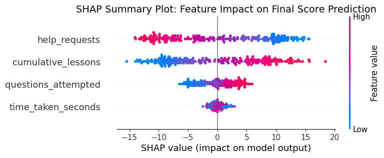

# Learning Success Predictor: A Machine Learning Analysis

## Overview

This project uses machine learning to predict student academic success based on their behavioral data from an online learning platform. It is inspired by current research in the field of Learning Analytics and AI in Education.

The core of the project is an **XGBoost** model trained on a simulated dataset of student logs. After training, the model is explained using **SHAP (Shapley values)** to identify the key behavioral drivers of learning performance.

## Inspiration

This work is directly inspired by the research of Professor Albert C.M. Yang and others in the field.

* **Yang, A. C. M., et al. (2022)** used clustering to identify different student behavior patterns, finding that "nonstandard behaviors" like a high reliance on hints did not lead to improved performance.
* **McIntyre, N. A. (2022)** demonstrated the power of using predictive models like XGBoost and interpretability tools like SHAP to analyze online learning data, highlighting the importance of cumulative experience and independent learner behavior.

This project combines these ideas by building a predictive model to forecast success and using SHAP to interpret the impact of the behaviors identified by researchers like Professor Yang.

## Methodology

1.  **Dataset:** A unique dataset of 1200 students was generated using Python, including behavioral features like `cumulative_lessons`, `time_taken_seconds`, `questions_attempted`, and `help_requests`.
2.  **Model:** An XGBoost Regressor model was tuned and trained to predict the `final_score` based on the behavioral features.
3.  **Interpretability:** SHAP (SHapley Additive exPlanations) was used to analyze the trained model and quantify the impact of each feature on the final score predictions.

## Results: What Drives Student Success?

The SHAP summary plot below visualizes the results from the tuned model. It ranks the features by importance and shows whether a high (red) or low (blue) value for that feature increases or decreases the predicted score.

**Key Insights:**
* **`help_requests`** is the most impactful feature. A high number of requests (red) strongly pushes the predicted score lower, confirming the findings that independent learning is crucial and that excessive help-seeking is a "nonstandard behavior" that can hinder learning.
* **`cumulative_lessons`** is the second most important feature. A high number of completed lessons (red) pushes the prediction higher, supporting the theory of deliberate practice and cumulative experience.
* **`questions_attempted`** also has a positive impact, suggesting that active engagement within a lesson is beneficial.

## How to Run

1.  Clone this repository.
2.  Install the required libraries: `pip install pandas numpy scikit-learn xgboost shap`
3.  Run the `learning_predictor.ipynb` notebook in a Jupyter or Google Colab environment.

### Limitations and Future Work

* **Simulated Data:** This model was trained on a simulated dataset. A crucial next step would be to apply this same methodology to real-world, anonymized student logs to validate the findings.
* **Feature Engineering:** Future iterations could include more complex features, such as the *timing* of help requests or the sequence of topics a student studies, to create a more powerful model. For example, one could analyze if behaviors change over time using temporal analysis.
* **Model Exploration:** While XGBoost is a powerful model, further research could compare its performance with other algorithms or explore different hyperparameter tuning strategies for optimal results.
